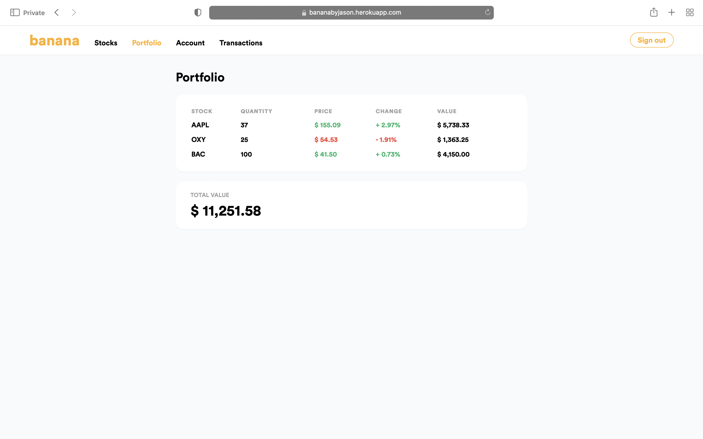

# Banana

## Project Description

Banana is a stock trading application built with Ruby on Rails. It features an admin dashboard and a trader dashboard, and sends users emails on account creation and account approval. Once their account is approved, users can add funds to their wallet and trade stocks.

## Preview


&nbsp;

&nbsp;

&nbsp;

&nbsp;


## Demo

[Link to Banana deployed on Heroku](https://bananabyjason.herokuapp.com/)

## Installation and Setup

```text
git clone git@github.com:jason-nn/batch14-stocks.git
```

```text
cd batch14-todo
```

```text
bundle install
```

```text
yarn install --check-files
```

```text
bundle exec rails webpacker:install
```

```text
rails db:create
```

```text
rails db:migrate
```

```text
rails db:seed
```

```text
rails server
```
